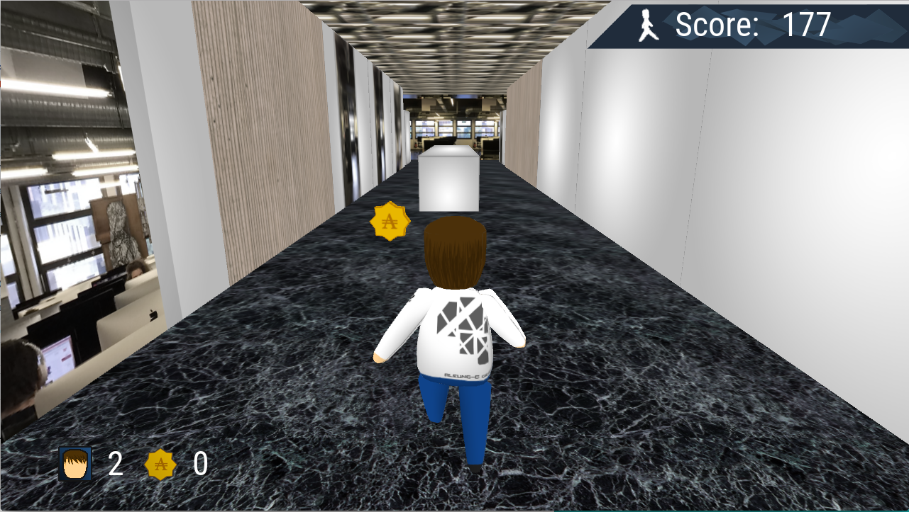
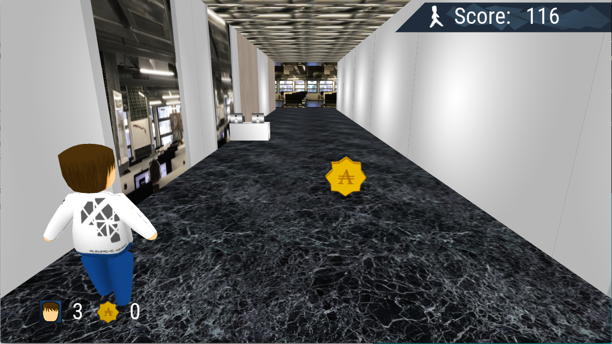
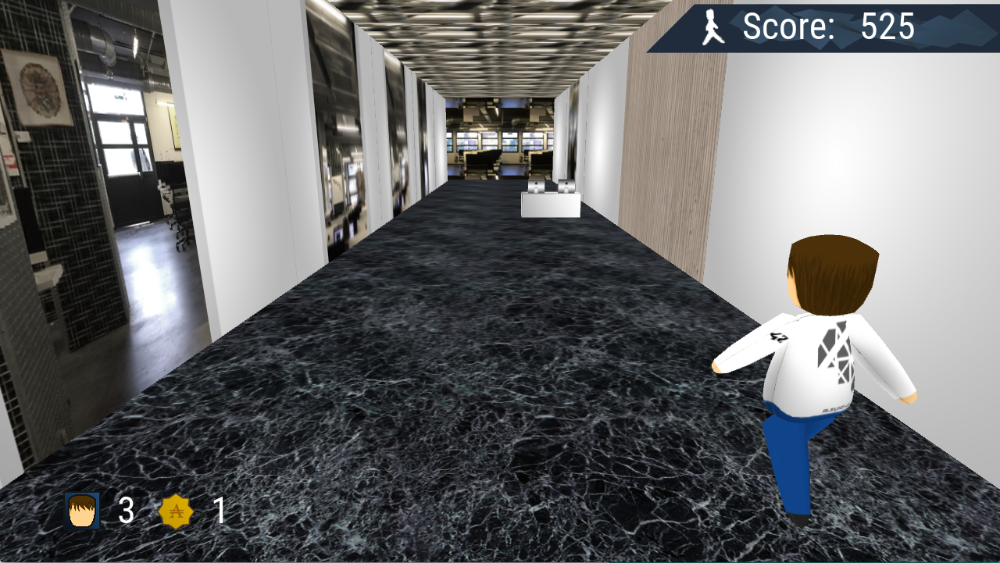

# 42run

This project is a simple TempleRun-like made in C++ with OpenGL and GLFW.

In this game, you play a student from school 42 that accidently crashed a teacher's bike. Now you have to run!

The game feature a school looking environment, obstacles to jump or avoid, and coins to pick up.
If you have more than 10 coins, you get one more life.

The more you play, the faster the game runs, and the more obstacles are spawned on your way.
The way it is made is pretty simple and memory efficient: the character does not move, and the world keeps going into the camera.
When the walls are far behind the camera, they are moved toward the top, and a random texture is applied to them.
The obstacles are loaded in the memory at the beginning of the program, and in the same way as the walls, are never reloaded.

The number of "objects" loaded in the program is fixed at launch and does not vary. This way, the loading process of the world, the "illusion" of the game is smooth, seamless, and allows many tweakings.

it uses the aleung-c_engine to handle all the OpenGL/GLFW pipeline,
which makes this program a "gameplay oriented" project.

Look up the [aleung-c_engine](https://github.com/aleung-c/aleung-c_engine) to have a look at the
engine side of the game.

Implemented on MacOS system.

